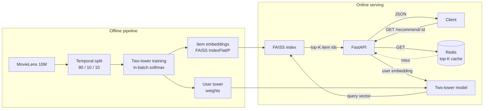

# recsys

Production-shaped movie recommender: **two-tower retrieval + FAISS ANN + FastAPI + Redis**, trained on MovieLens 10M, served from a multi-stage Docker container with **single-digit-millisecond p99 latency**.

## Architecture



## Results

Trained on MovieLens 10M (**69,878 users × 10,196 items**, 80/10/10 chronological split). Ranking eval over 5,000 sampled users; ground truth = test interactions with rating ≥ 4.0.

### Offline (model quality)

| Model | Test RMSE | Recall@10 | NDCG@10 |
|---|---:|---:|---:|
| Matrix Factorization | **0.930** | 0.0374 | **0.2087** |
| Two-Tower + FAISS | n/a (ranking only) | 0.0356 | 0.1515 |

MF wins offline metrics narrowly; two-tower trades a small gap for orders-of-magnitude faster serving (see below). Temporal splits are deliberately strict — academic benchmarks using random splits report inflated numbers.

### Online (serving — Docker container, CPU-only, M-series host, 200 requests)

| Latency | cache miss | cache hit |
|---|---:|---:|
| **p50** | 1.91 ms | 0.53 ms |
| **p95** | 2.41 ms | 0.91 ms |
| **p99** | **5.25 ms** | **1.00 ms** |
| max | 5.35 ms | 3.00 ms |
| throughput | 497 req/s/worker | 1,673 req/s/worker |

End-to-end wall-clock: TCP → HTTP parse → user lookup → torch forward (batch=1) → FAISS top-K → JSON serialize → response. No GPU.

## Quickstart

### Local (development)

```bash
uv sync --all-extras
uv run recsys-prepare      # download MovieLens 10M, clean, split, save parquet (~2 min)
uv run recsys-train-tt     # train two-tower + build FAISS index (~3 min on M-series MPS)
uv run uvicorn recsys.api.main:app --port 8000
```

### Docker (api + redis)

```bash
docker compose up --build -d
curl -s "http://localhost:8000/recommend/1?k=5" | jq
```

### Sample request / response

```bash
$ curl -s "http://localhost:8000/recommend/1?k=3"
{
  "user_id": 1,
  "k": 3,
  "recommendations": [
    {"movie_id": 355, "title": "Flintstones, The (1994)",                "score": 0.642},
    {"movie_id": 181, "title": "Mighty Morphin Power Rangers (1995)",    "score": 0.625},
    {"movie_id": 519, "title": "RoboCop 3 (1993)",                       "score": 0.619}
  ],
  "cache_hit": false,
  "latency_ms": 1.87
}
```

## Project layout

```
src/recsys/
├── api/              # FastAPI app: /health, /recommend
├── data/             # download, clean, temporal split, PyTorch Dataset
├── eval/             # Recall@K, NDCG@K with seen-item masking
├── models/           # MatrixFactorization, TwoTower
├── train.py          # MF training (recsys-train)
└── train_tt.py       # two-tower + FAISS (recsys-train-tt)
scripts/bench.py      # latency benchmark
Dockerfile            # multi-stage, slim, non-root
docker-compose.yml    # api + redis
```

## Engineering notes

- **Temporal split** prevents future-information leakage; production recsys are evaluated this way.
- **In-batch softmax** for two-tower means each positive's negatives are the *other positives in the batch* — efficient on GPU and matches the YouTube two-tower paper.
- **L2-normalized item embeddings** make dot-product equal cosine similarity, which is what `faiss.IndexFlatIP` consumes natively.
- **macOS faiss/torch share OpenMP** — without `KMP_DUPLICATE_LIB_OK=TRUE` and `faiss.omp_set_num_threads(1)`, the API SIGSEGVs on first FAISS call.
- **Redis cache key** is `rec:{user_id}:{k}` with 5-minute TTL; absent `REDIS_URL` env var the API runs without cache.

## Development

```bash
uv run pytest              # tests
uv run ruff check . && uv run ruff format --check .
uv run mypy src
uv run python scripts/bench.py    # latency sweep against running API
```

CI runs lint + type-check + tests on every push (`.github/workflows/ci.yml`).
